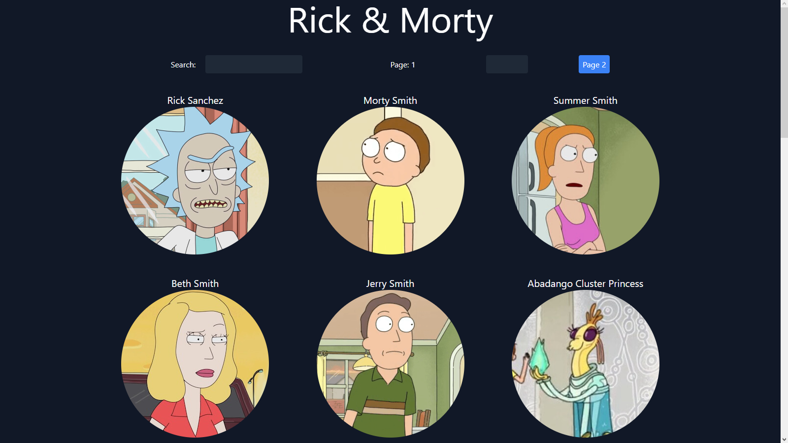

# Rick and Morty

## Description

A web application developed with React.js using the Rick and Morty API. This project use the API to show the characters, locations and episodes of the series.

## Screenshots

## Features

-   Filter characters by name
-   Pagination
-   Direct navigation to a page
-   Show character details

## Technologies

-   [React.js](https://reactjs.org/): A JavaScript library for building user interfaces.
-   [TypeScript](https://www.typescriptlang.org/): A typed superset of JavaScript that compiles to plain JavaScript.

## Deployment

[Rick and Morty](https://amv1909.github.io/Rick-And-Morty-TypeScript/)
